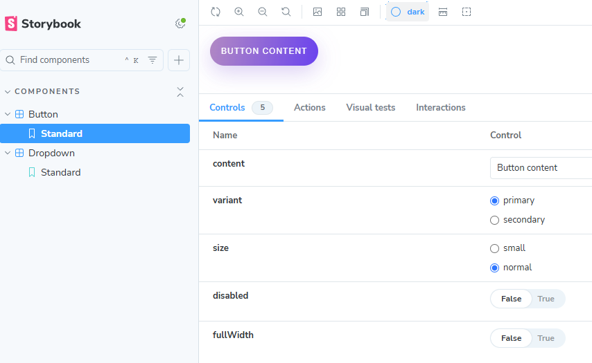
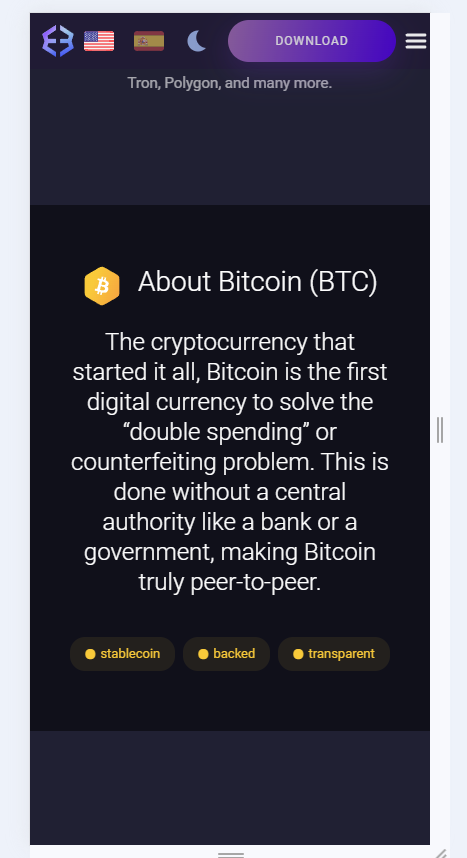
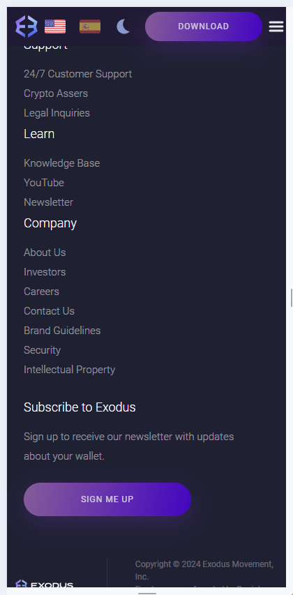

# Web Development / CMS Hire Code Challenge

## Overview

This challenge is designed to evaluate your skills in implementing designs from Figma, designing component systems/libraries, and setting up CMS.

> [!IMPORTANT]
> There's a LOT to this challenge.
> Please budget 8 hours for what you think is reasonable to accomplish and stop there. If you're to skip a part completely, skip Part 2. In your submission, please clarify which parts / bullets you skipped.

## Part 1: Implementing Designs from Figma

### Task

Convert the linked [Figma](./Exodus_Assets.fig) design into a responsive webpage using Gatsby + React and the styling/component libraries of your choice (please explain why you chose them though).

### Requirements

1. **Pixel-perfect implementation**: The design should closely match the provided Figma file.
2. **Responsiveness**: The page should be fully responsive, adapting well to different screen sizes.
3. **Accessibility**: Follow basic accessibility guidelines (e.g. proper use of ARIA labels, semantic HTML elements).

**N.B.** The design file is based on our [Bitcoin Wallet Landing Page](https://www.exodus.com/bitcoin-wallet). You can use that as a reference to source imagery. Consider that the page needs to be replicated for a multitude of assets. A member of the Marketing Team should be able to create a page easily from the CMS (see part 3).

### Deliverables

-   A GitHub repository with the source code.
-   A live demo link (e.g. using GitHub Pages, Vercel, Netlify, or the CMS you choose in Part 3).
-   Document and/or creata a short video demo the build/deploy workflow.

## Part 2: Code Re-use Via a Component Library

### Task

Create a reusable component library based on the Figma design from Part 1.

### Requirements

1. **Component-based architecture**: Break down the design into reusable components.
2. **Documentation**: Provide clear documentation on how to use the components.
3. **Theming**: Implement basic theming capabilities (e.g. light and dark modes).

### Deliverables

-   The same GitHub repository as Part 1, with the component library code.

## Part 3: CMS

### Task

1. **CMS setup**: Choose a CMS (e.g. Contentful, Strapi, Netlify CMS) and model the pages you designed in Part 1. Integrate Gatsby with the CMS.
2. [Bonus] **Deploy previews**: Configure deploy previews for content changes made by non-developers. We can't expect the marketing team to submit pull requests for copy changes.
3. [Bonus] **A/B testing**: Set up basic A/B testing functionality, e.g. to test different hero section images or light vs dark as a default theme.

### Deliverables

-   Short explainer defending your choice of CMS.
-   A GitHub repository with the CMS configuration and integration code. This can be the same repository as in Part 1.
-   Video demo on how to use the CMS for managing content, deploy previews, and A/B testing.
-   (Ideally) provide a live deployment for us to play with.

   

# Tiho's notes about assignment

## Tech stack

Gatsby + React + styled-components + react-bootstrap + zod + i18next

## Code organization

-   pages - just a single page here
-   sections - larger chuks like HeroPanel, Footer etc.
-   components - things like ThemeToggle and TopBar
-   context - any react contexts used in the app
-   hooks - various hooks like use-debounce
-   images - images folder
-   locales - translactions
-   utils

## Integration with CMS

So I choose Contentful, as its the only one that seems to be properly maintained, and also has like 100x active monthly users compared to the other contenders. It was pretty easy to setup and integrate.
My content model is

-   Hero Panel - title(text), text(text), heroImage(media), rawHTML(text)
-   Summary Panel - title(text), text(text), previewImage(media), svgContent(text)
-   Footer Content - linkColumns(JSONObject)

## Component library

-   styled-components
-   react-bootstrap
-   storybook
-   rollup

Theming + components.

Themes: light and dark
Components: Button, Dropdown

Exports the components, types and colors.
Available publicly at: https://www.npmjs.com/package/tiho-component-library

Storybook screenshot:

Base site (dark theme, english language):

Spanish version:

Light theme:

Mobile screen example:

