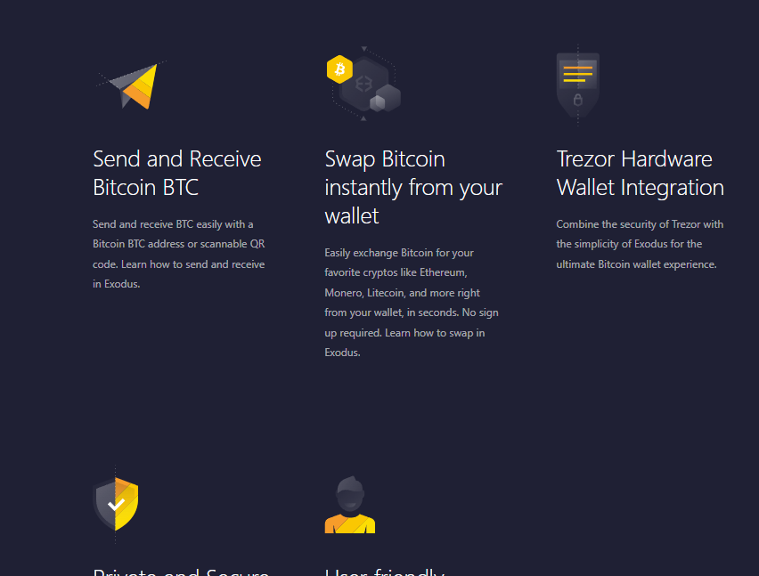

# Tiho's notes about assignment

## Hi there,
I'm pleased to have this opportunity to audition for the role of Senior Front-End Engineer.

Here are some notes about my code and thinking

### Tech stack

Gatsby as is required in the assignment + React because its 2024 (and also required in the assignment). For styling I choose react-bootstrap, because I inspected the Exodus webpage and found some bootstrap classes. Though it would be interesting to explore. In the past I've worked extensively with material-ui and tailwind. 

### Code organization

I choose to split the page into the following components: Topbar, Header, HeroPanel, SummaryPanel, SummaryPanelItem and Footer. The really reusable ones here are HeroPanel and SummaryPanel. CSS is in a style.css file next to the index.tsx file in each folder. 

### Design 

Its as pixel perfect as I was able to make it in ~8-10 hours. Things I know are missing: hover effect on yellow dropdowns, aria-labels, breakpoints on top of the default bootstrap defaults, hamburger menu for when the screen is too narrow for top dropdowns to fit, top bar to narrow when user scrolls down, some fonts, dropdown menu styling, enter effects for elements as the user scrolls down the page. 

Things I done to a degree: on hover effect on the download button, Dropdown caret replacement, somewhat reasonable breakpoints throughout the page (only unreasonable one is the top nav dropdowns, which should be replaced by a hamburgler when the container is too narrow). Overall layout and look of the page.

### Functionality

Other than the dropdowns doing dropdown things, I didn't really put in any functionality on there. Only use of React is one useStaticQuery hook. Not that I don't know how to use React, I'm actually quite fond and familiar with React, it just didn't seem to be needed anywhere to achieve what was requested in the assignment.

### Integration with CMS

So I choose Contentful, as its the only one that seems to be properly maintained, and also has like 100x active monthly users compared to the other contenders. It was pretty easy to setup and integrate. I'm not pulling everything from Contentful, it would just take more time to migrate everything, so I focused on the obvious CMS-y bits: the "HeroPanel" elements that have the one image, and the title and text elements. 

And the "summary" elements below that have the yellow icons on them. 

## Parts that I skipped

Due to time considerations I decided to leave out the following things: 
- "About Bitcoin (BTC)" panel
- The interactive graph (that looks like 8 hours of work in itself. Also, it doesn't work for me for any timespan over 1M on the live exodus website)
- The repeated downlaods panel below
- Trustpilot widget (that surely is just a widget)

### Code Re-use Via a Component Library

Didn't have time. I have whole codebases of material-ui, styled-components component and theming libraries. Wanted to try making a Bootstrap5 one from scratch. Didn't work out, not sure why but it wasn't importing the ThemeProvider into my main project correctly. After about 2 hours total I abandoned the effort. 
I do feel very comforatble working on, and working with, themes and component libraries. 

## Final words

If you've gotten this far. Please give job. =D

    
Original assignment following from here:

# Web Development / CMS Hire Code Challenge

## Overview

This challenge is designed to evaluate your skills in implementing designs from Figma, designing component systems/libraries, and setting up CMS.

> [!IMPORTANT]
> There's a LOT to this challenge.
> Please budget 8 hours for what you think is reasonable to accomplish and stop there. If you're to skip a part completely, skip Part 2. In your submission, please clarify which parts / bullets you skipped.

## Part 1: Implementing Designs from Figma

### Task

Convert the linked [Figma](./Exodus_Assets.fig) design into a responsive webpage using Gatsby + React and the styling/component libraries of your choice (please explain why you chose them though).

### Requirements

1. **Pixel-perfect implementation**: The design should closely match the provided Figma file.
2. **Responsiveness**: The page should be fully responsive, adapting well to different screen sizes.
3. **Accessibility**: Follow basic accessibility guidelines (e.g. proper use of ARIA labels, semantic HTML elements).

__N.B.__ The design file is based on our [Bitcoin Wallet Landing Page](https://www.exodus.com/bitcoin-wallet).  You can use that as a reference to source imagery.  Consider that the page needs to be replicated for a multitude of assets.  A member of the Marketing Team should be able to create a page easily from the CMS (see part 3).

### Deliverables

- A GitHub repository with the source code.
- A live demo link (e.g. using GitHub Pages, Vercel, Netlify, or the CMS you choose in Part 3).
- Document and/or creata a short video demo the build/deploy workflow.

## Part 2: Code Re-use Via a Component Library

### Task

Create a reusable component library based on the Figma design from Part 1.

### Requirements

1. **Component-based architecture**: Break down the design into reusable components.
2. **Documentation**: Provide clear documentation on how to use the components.
3. **Theming**: Implement basic theming capabilities (e.g. light and dark modes).

### Deliverables

- The same GitHub repository as Part 1, with the component library code.

## Part 3: CMS

### Task

1. **CMS setup**: Choose a CMS (e.g. Contentful, Strapi, Netlify CMS) and model the pages you designed in Part 1. Integrate Gatsby with the CMS.  
2. [Bonus] **Deploy previews**: Configure deploy previews for content changes made by non-developers. We can't expect the marketing team to submit pull requests for copy changes.
3. [Bonus] **A/B testing**: Set up basic A/B testing functionality, e.g. to test different hero section images or light vs dark as a default theme.

### Deliverables

- Short explainer defending your choice of CMS.
- A GitHub repository with the CMS configuration and integration code. This can be the same repository as in Part 1.
- Video demo on how to use the CMS for managing content, deploy previews, and A/B testing.
- (Ideally) provide a live deployment for us to play with.
